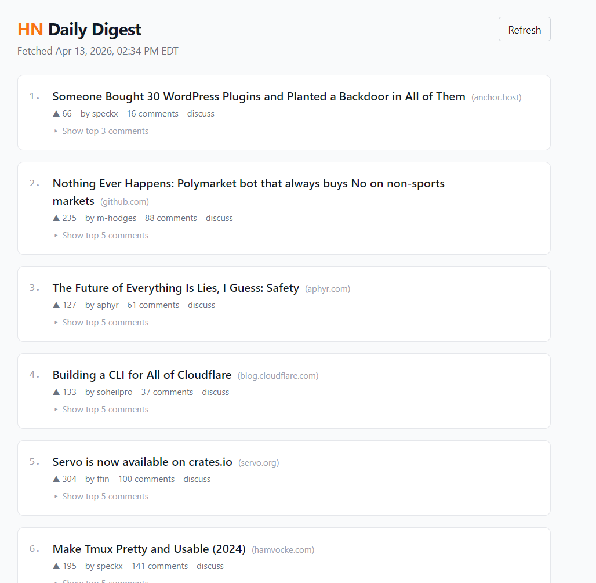

# HN Daily Digest

A web app that fetches the top 10 Hacker News posts every morning, commits a clean JSON digest to the repo, and lets you read summaries and ask Gemini questions about today's tech news.

**Live demo:** [https://your-vercel-url.vercel.app](https://your-vercel-url.vercel.app)


**NOTE:** This is the platform's interface. It updates daily at 8:00 AM UTC

---

## Features

- Reads today's top 10 Hacker News posts with scores, authors, and comment counts
- Expandable top 5 comments per post — no need to open the HN thread
- Chat-style Q&A powered by Gemini 2.5 Flash Lite ("What's the most controversial post?")
- Persistent chat history for follow-up questions within the session
- Refresh button re-fetches live HN data directly in the browser
- Zero sign-in, zero database, zero infrastructure beyond Vercel + GitHub Actions

---

## Architecture

```
┌──────────────────────────────────────────────────────────────────┐
│                         DAILY ETL                                │
│                                                                  │
│  HN Firebase API                                                 │
│  (no key needed)                                                 │
│       │                                                          │
│       ▼                                                          │
│  GitHub Actions                                                  │
│  (daily-digest.yml                                               │
│   runs at 8am UTC)                                               │
│       │                                                          │
│       ▼  commits                                                 │
│  public/data/digest.json  ──────▶  GitHub repo                  │
│                                         │                        │
│                                   auto-deploy                    │
└──────────────────────────────────────────────────────────────────┘
                                          │
                                          ▼
                                   Vercel build
                                   (reads JSON at
                                    build time)
                                          │
                                          ▼
                                   Static Next.js page
                                   (served from edge)
                                          │
                         ┌────────────────┴────────────────┐
                         │                                 │
                  Refresh button                     Chat input
                         │                                 │
                  GET /api/refresh              POST /api/ask
                  (live HN fetch,                    │
                   no commit)               Gemini 2.5 Flash Lite
                                            (server-side,
                                             no caching)
```

---

## Tech Stack

| Layer | Technology |
|---|---|
| Frontend | Next.js 14 (App Router), React 18 |
| Styling | Tailwind CSS |
| AI | Gemini 2.5 Flash Lite via `@google/generative-ai` |
| ETL | Node.js script (`scripts/fetch-digest.mjs`) |
| Pipeline | GitHub Actions (`daily-digest.yml`) |
| Data source | HN Firebase REST API (free, no key) |
| Hosting | Vercel (auto-deploys on push) |
| Unit tests | Jest + React Testing Library |
| E2E tests | Playwright |

---

## Prerequisites

- Node.js 20+
- A [Google AI Studio](https://aistudio.google.com/) account with a Gemini API key
- A GitHub account with a Personal Access Token (repo scope) for GitHub Actions

---

## Local Setup

```bash
# 1. Clone the repo
git clone https://github.com/YOUR_USER/hacker-news-daily-digest.git
cd hacker-news-daily-digest

# 2. Install dependencies
npm install

# 3. Create your local env file
cp .env.local.example .env.local
# Edit .env.local and fill in GEMINI_API_KEY

# 4. Generate digest.json from HN API
node scripts/fetch-digest.mjs
# → writes public/data/digest.json

# 5. Start the dev server
npm run dev
# → open http://localhost:3000
```

---

## Environment Variables

| Variable | Where to get it | Required |
|---|---|---|
| `GEMINI_API_KEY` | [Google AI Studio](https://aistudio.google.com/) → Get API key | Yes |

For local development, set this in `.env.local`. For production, set it in Vercel project settings (see [Deployment](#deployment)).

---

## GitHub Actions Setup

The workflow in `.github/workflows/daily-digest.yml` runs `scripts/fetch-digest.mjs` daily at 8am UTC, commits the result to `main`, and Vercel auto-deploys the new file.

**Step 1 — Add the PAT secret:**

1. Create a GitHub Personal Access Token with `repo` scope at [github.com/settings/tokens](https://github.com/settings/tokens)
2. In your repo: **Settings → Secrets and variables → Actions → New repository secret**
3. Name: `GH_PAT`, Value: your PAT

**Step 2 — Trigger manually (optional):**

Go to **Actions → Daily HN Digest → Run workflow** to run it immediately without waiting for 8am.

**What the workflow does:**
1. Checks out the repo using `GH_PAT`
2. Sets up Node 20
3. Runs `node scripts/fetch-digest.mjs` (fetches HN, writes JSON)
4. Commits `public/data/digest.json` only if it changed
5. Pushes to `main` → triggers Vercel redeploy

---

## Running Tests

**Unit tests (Jest + React Testing Library):**
```bash
npm test                    # run all Jest tests once
npm run test:watch          # watch mode
```

**ETL unit tests (ESM, requires `--experimental-vm-modules`):**
```bash
npm run test:etl            # tests for scripts/fetch-digest.mjs
```

**E2E tests (Playwright):**
```bash
npx playwright install      # first time only — installs browser binaries
npm run test:e2e            # headless
npm run test:e2e:ui         # Playwright UI mode (interactive)
```

> E2E tests start the dev server automatically (`npm run dev`) and mock all external API calls (HN and Gemini), so no live credentials are needed.

---

## Deployment

**Step 1 — Import to Vercel:**

1. Go to [vercel.com/new](https://vercel.com/new)
2. Import your GitHub repo
3. Framework preset: **Next.js** (auto-detected)
4. Click **Deploy**

**Step 2 — Add the environment variable:**

1. In your Vercel project: **Settings → Environment Variables**
2. Add `GEMINI_API_KEY` with your key, scoped to Production + Preview + Development
3. Redeploy (Settings → Deployments → Redeploy latest)

**Step 3 — Verify:**

- Visit your Vercel URL — posts should load (using the placeholder `digest.json` until Actions runs)
- Click **Refresh** to pull live HN data
- Ask a question in the chat to confirm Gemini is working
- Manually trigger the GitHub Actions workflow to confirm it commits and Vercel redeploys

---

## Project Structure

```
hacker-news-daily-digest/
│
├── .github/
│   └── workflows/
│       └── daily-digest.yml        # cron ETL: runs at 8am UTC, commits JSON
│
├── public/
│   └── data/
│       └── digest.json             # committed by Actions; read at build time
│
├── scripts/
│   └── fetch-digest.mjs            # Node ETL: fetch HN → clean → write JSON
│
├── src/
│   ├── app/
│   │   ├── api/
│   │   │   ├── ask/
│   │   │   │   └── route.ts        # POST: Gemini Q&A (server-side)
│   │   │   ├── digest/
│   │   │   │   └── route.ts        # GET: read committed digest.json
│   │   │   └── refresh/
│   │   │       └── route.ts        # GET: live HN fetch (no commit)
│   │   ├── DigestClient.tsx        # client component: posts + chat + refresh
│   │   ├── globals.css
│   │   ├── layout.tsx
│   │   └── page.tsx                # server component: reads JSON via fs
│   └── types/
│       └── digest.ts               # Digest, Post, Comment TypeScript types
│
├── __tests__/
│   ├── api/
│   │   ├── ask.test.ts             # Jest: /api/ask unit tests
│   │   └── digest.test.ts          # Jest: /api/digest unit tests
│   ├── components/
│   │   └── DigestClient.test.tsx   # Jest + RTL: UI behavior tests
│   └── scripts/
│       └── fetch-digest.test.mjs   # Jest (ESM): ETL pure function tests
│
├── tests/
│   └── e2e/
│       └── digest.spec.ts          # Playwright: full browser e2e tests
│
├── docs/
│   ├── PRD.md                      # product requirements document
│   └── design-decisions.md        # architectural Q&A record
│
├── jest.config.ts
├── jest.setup.ts
├── playwright.config.ts
├── next.config.ts
├── tailwind.config.ts
├── tsconfig.json
└── package.json
```

---

## Known Limitations

- **No historical data** — only today's digest; no archive or date picker
- **No real-time updates** — data refreshes once daily via cron; the Refresh button fetches live data but doesn't persist it
- **No Gemini caching** — every question makes a new API call; costs accumulate at high traffic
- **No rate limiting** on `/api/ask` — could be abused in a public deployment
- **Vercel deploy lag** — after the Actions cron runs, the new data is live only once Vercel finishes its auto-deploy (~2–5 minutes)
- **No mobile app** — web only

---

## Contributing

This is a personal project, but PRs are welcome. Open an issue first to discuss the change, keep PRs scoped to one concern, and make sure `npm test` and `npm run lint` pass before submitting. The [design decisions doc](docs/design-decisions.md) explains the major architectural trade-offs if you want context before proposing a change.

---

## License

MIT
